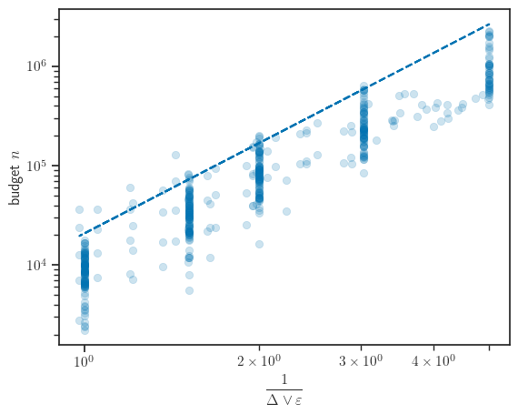
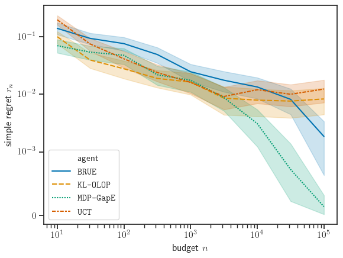
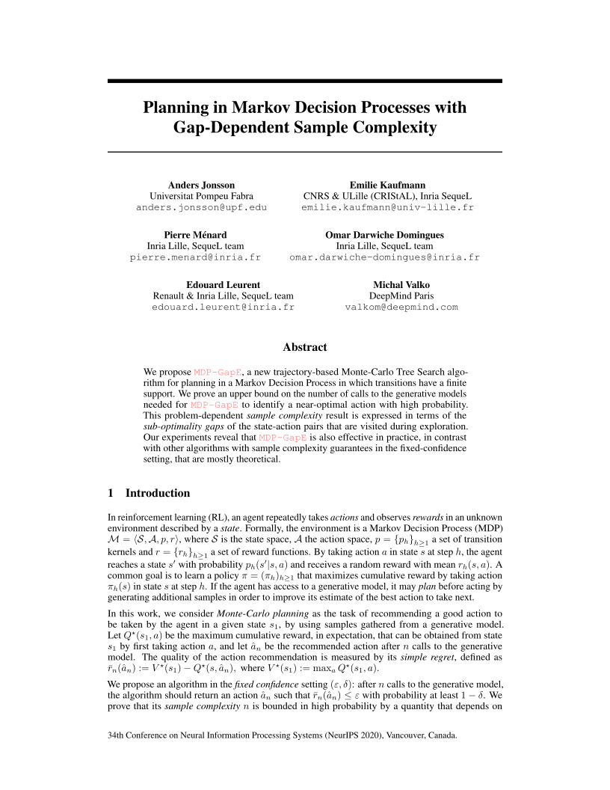

# Abstract

We propose `MDP-GapE`, a new trajectory-based Monte-Carlo Tree Search algorithm for planning in a Markov Decision Process in which transitions have a finite support. We prove an upper bound on the number of calls to the generative models needed for `MDP-GapE` to identify a near-optimal action with high probability. This problem-dependent *sample complexity* result is expressed in terms of the *sub-optimality gaps* of the state-action pairs that are visited during exploration. Our experiments reveal that `MDP-GapE` is also effective in practice, in contrast with other algorithms with sample complexity guarantees in the fixed-confidence setting, that are mostly theoretical.

----------------------------

# Paper and Bibtex

<div style="display: flex;">
<div style="flex: 0 0 15em;">
	<a href="{{ site.paper_url }}">
		
		<br>
		<h2>[Paper]</h2>
	</a>
</div>
<div style="flex: auto" markdown="1">

## Citation

Jonsson A., Kaufmann E., Ménard P., Domingues O., Leurent E. and Valko M., 2020. *Planning in Markov Decision Processes with Gap-Dependent Sample Complexity.* In Advances in Neural Information Processing Systems.

## [[Bibtex]](cite.bib)

```
@incollection{Jonsson,
    title={Planning in Markov Decision Processes
    	with Gap-Dependent Sample Complexity},
    author={Anders Jonsson and Emilie Kaufmann and
    	Pierre Ménard and Omar Darwiche Domingues and
    	Edouard Leurent and Michal Valko},
    booktitle={Advances in Neural Information
    	Processing Systems 33},
    publisher={Curran Associates, Inc.},
    year={2020},
}
```
</div>
</div>

----------------------------
# Experiments

## Installation

1. Install the [finite-mdp](https://github.com/eleurent/finite-mdp) environment

`pip install --user git+https://github.com/eleurent/finite-mdp`

2. Install the [rl-agents](https://github.com/eleurent/rl-agents) implementations.

`pip install --user git+https://github.com/eleurent/rl-agents`

## Instructions

The experiments can be reproduced by running:

### Table 4 and Figure 1
```bash
python planners_evaluation_confidence.py --epsilons=[1, 0.5, 0.2] --seeds=200
```

### Figure 2
```bash
python planners_evaluation_budget.py --budgets=1,5,9 --seeds=200
```

The figures and data will appear in the `scripts/out` directory.


----------------------------

# Acknowledgements

We acknowledge the support of the European CHIST-ERA project DELTA. Anders Jonsson is partially supported by the Spanish grants TIN2015-67959 and PCIN-2017-082.